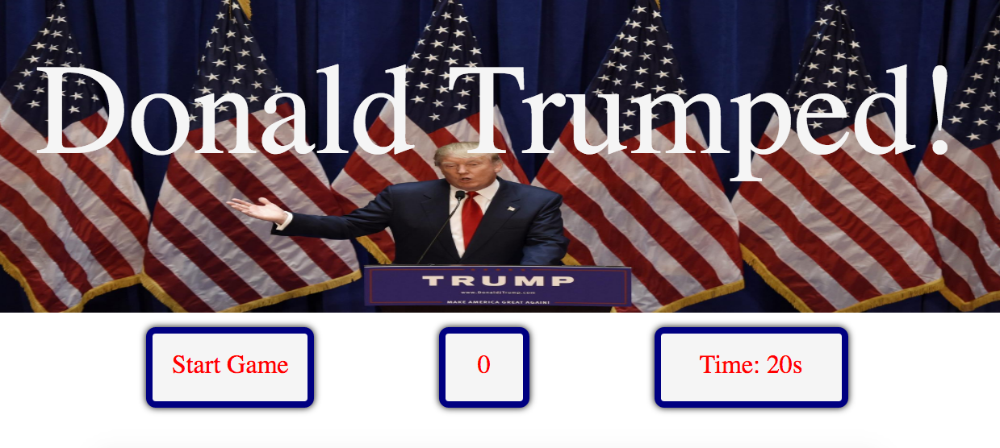

<figure>
	
	<figcaption>Help Donald make America great again!</figcaption>
</figure>

This is my first project for General Assembly. It's a simple game which tests your mouse-clicking skills. It being my first project, I just wanted something which works.

I built it with Javacsript, HTML and SASS.
